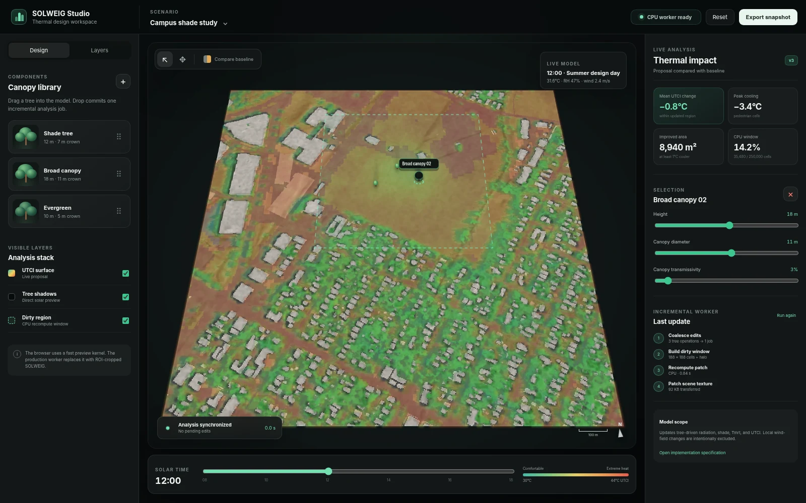

# Incremental CPU design tool

## Status

This document set is the implementation specification for a small-area, interactive tree-placement tool built on SOLWEIG-GPU. The target experience is a design-support application rather than a batch simulation interface: a user drags, moves, resizes, or removes one or more tree components, the interface immediately shows a visual preview, and a single CPU worker refines only the affected spatial region.

The repository currently contains the following completed scaffolding:

| Deliverable | Status | Location |
|---|---|---|
| Conservative dirty-region geometry | Implemented and unit tested | `solweig_gpu/incremental/geometry.py` |
| Binary sky-patch packing primitives | Implemented and unit tested | `solweig_gpu/incremental/bitmask.py` |
| Edit coalescing primitives | Implemented and unit tested | `solweig_gpu/incremental/edits.py` |
| Packed-visibility primitive benchmark | Recorded | `docs/incremental_design_tool/benchmarks/packed_visibility.md` |
| Scaffolding validation report | Recorded | `docs/incremental_design_tool/validation/scaffolding_validation.md` |
| Interactive frontend prototype | Implemented and tested | `studio/` |
| Browser preview kernel | Implemented for interaction testing only | `studio/solver_kernel.mjs` |
| Scientific ROI-cropped SOLWEIG worker | Designed, not implemented | See [Incremental algorithm](incremental_algorithm.md) |
| Production API and persistence | Designed, not implemented | See [API contract](api_contract.md) |

The browser preview kernel is not a scientific substitute for SOLWEIG. It validates the interaction flow, stale-job handling, dirty-window protocol, patch application, and visual language while the exact server worker is being implemented.



## Product objective

A user should be able to perform the following sequence in a teaching session or live demonstration:

1. Open a preloaded 500 × 500 cell study tile.
2. Drag a tree component onto the site.
3. See the tree and an approximate cast shadow immediately.
4. Continue editing without waiting for a full-domain simulation.
5. Receive an exact, CPU-computed update for the changed region within the latency budget.
6. Compare the proposal with the immutable baseline.
7. Export the current result or continue adding trees.

The target domain does not expand beyond the supplied tile scale. The architecture therefore prioritizes predictable latency, low operating cost, and correctness of local invalidation over city-scale throughput.

## Scope

The incremental worker updates tree-driven changes to:

- direct solar shade;
- vegetation sky-view obstruction;
- shortwave and longwave radiation terms affected by vegetation;
- mean radiant temperature (Tmrt);
- Universal Thermal Climate Index (UTCI);
- optional derived teaching metrics such as improved area and peak cooling.

The first production release does not recompute:

- a CFD wind field after every tree edit;
- tree-driven humidity or evapotranspiration feedback;
- building geometry, terrain, wall height, or wall aspect;
- arbitrary city-scale uploads;
- multiple simultaneous scientific jobs on one worker.

Wind coefficients remain the precomputed baseline input. The interface must state this limitation in the model-scope disclosure.

### Model scope per edit family

The universal editing chain (adapters, planner, PlanExecutor) executes five
edit families end-to-end. Measured routing on the real 500 × 500 @ 2 m tile
([benchmark](benchmarks/2026-09-03-ud-perf.json), UEDIT-008):

| Family | Payload measured | Routing (measured) | Why |
|---|---|---|---|
| `vegetation_geometry` | tree add, h 6 m, r 3 m | local (dirty fraction 0.16) | planner scopes vegetation WINDOWS (adapter directional_windows); no FULL node impact → executor keeps worker routing; worker dirty fraction 0.16 < full_recompute_fraction 0.30 → LOCAL (executor-local windowed path) |
| `meteorological_forcing` | air_temperature at t=12 | full | planner scopes downstream FULL (meteorological_forcing is full_downstream_only); executor force_full AND worker forcing_pending → full tile (executor-full) |
| `landcover_surface` | paint 44 × 44 window class 5 → 1 | local (dirty fraction ~0.019) | planner scopes landcover WINDOWS (adapter windows); no FULL impact; worker dirty fraction ~0.019 < 0.30 → LOCAL (executor-local windowed path) |
| `building_geometry` | building add, 12 × 16 px, h 14 m | full | building_geometry is FULL_ONLY_INITIALLY → planner marks FULL; the batch routes through the regeneration chain (scenario site + DSM + walls/aspect + SVF + cache rebuild + full-tile solve), not ExactWorker.run (executor-full) |
| `model_receptor_parameters` | albedo_b 0.2 → 0.35 | full | model_receptor_parameters is full_downstream_stage_specific → planner scopes FULL; worker model_parameters_pending → full tile (executor-full) |
| mixed batch | meteorology + others | full | mixed batch contains meteorology (full_downstream_only) → plan marks FULL nodes; worker forcing closure routes full tile (executor-full) |

The `why` strings are the planner's own routing reasons, adapted from the
benchmark's `families[].routing` records: the ASCII arrows are normalized
(`->` → `→`) and numeric thresholds are rounded for prose (e.g. the
landcover worker dirty fraction 0.018496 → ~0.019).

**Post-building-edit routing disclosure (u-d4c).** The routing rows were
measured on fresh scenarios carrying no published building edits, and they
remain exact for every such scenario. Once a scenario has published a
building edit, the executor accumulates the massing fold and every later
batch — any family — routes through the building regeneration chain full
tile with the full fold: the baseline-bound worker path would silently
revert the published buildings (a pre-existing engine defect since the
u-c5/u-c6 chain seam, exposed user-facing by the universal transport and
fixed with the fold). The cost consequence is real and not hidden: a
post-building vegetation or land-cover batch that measured ~56 s local
instead pays the chain's cost class (~242 s p50) until the scenario
resets. Chain-routed batches disclose this in their diagnostics
(`building_batch`, `building_fold_size`, `chain_carries_new_edits`);
deletes stay deletes in the fold, and the fold persists across executor
restarts (scenario-state schema v3). Full statement in the
[benchmark](benchmarks/2026-09-03-ud-perf.json)
(`routing_disclosure_post_building_edit`).

**Fold order-and-overlap disclosure (u-d4c remediation).** The fold
applies to the chain in dict first-insertion order — each building id's
position is fixed by its first appearance in the session, not by the
session order of its latest edit — and the rasterizer replays that
tuple sequentially: a delete's before-footprint reset is unconditional
(it erases bystander paint at overlaps) while after-paints combine by
fmax (taller wins). Overlapping distinct building ids therefore resolve
by application order and can diverge from a session-order sequential
replay: add A, add B overlapping A, delete A folds to
`[A_tombstone(reset FA), B(paint FB)]` and keeps B intact at FA∩FB,
whereas a sequential replay `[A, B, A_delete]` would truncate B there;
deleting the later-inserted id instead (`[A, B_tombstone]`) truncates A
at the overlap in both orderings, so the divergence is asymmetric. It
is bounded to the overlap cells of distinct building ids (the adapter
carries no building inventory, so per-id last-write-wins cannot express
cross-id occlusion; the fold semantics is unchanged and remains the
mission-endorsed choice — this is a disclosure, not a behavior change).
Ops note: every in-flight scenario carrying a u-d4/u-d4b-era scenario
state v2 snapshot will fail its next family job with the typed
version-refusal until it is reset (a reset edit heals the scenario; the
refusal message names this remediation).

**UEDIT-010 disclosure (dynamic wind).** Tree-induced local wind-field
changes are not recomputed. This limitation is fenced and disclosed at three
sites, which must stay in agreement:

1. **Registry fence** — `dynamic_wind_from_geometry` is registered with
   status `scientific_extension`, `integrated: false`, fenced out of the
   executable set (`solweig_gpu/incremental/edit_registry.py`; the adapter
   may not claim semantics it cannot deliver).
2. **Capability document** — `GET /api/v1/capabilities` discloses the
   adapter as non-integrated with its status and notes (served from the same
   registry state; `solweig_gpu/server/routes_capabilities.py`).
3. **Frontend surface** — the studio renders non-integrated adapters as
   disabled disclosure cards quoting the document verbatim
   (`studio/capabilities.mjs`,
   `app.mjs`); the model-scope limitations line shown to the user carries
   the same statement ([ADR 0003](adr/0003-fixed-wind-scope.md)).

**GPU-path differential: OPEN.** All evidence above was measured on the CPU
chain only. The GPU execution path's incremental behaviour (windowed
composition, routing thresholds, publish semantics) has not been
differentially validated and remains an open item; no GPU-path claim is
made by this document set.

## Primary constraints

| Constraint | Target |
|---|---|
| Spatial domain | 500 × 500 cells at approximately 2 m resolution |
| Deployment | One CPU node, initially 2 to 4 vCPU and 4 GB RAM |
| Worker concurrency | One exact scientific job at a time |
| Interaction preview | Less than 100 ms on the client |
| Typical exact update | Less than 30 s for one ordinary tree edit |
| Required p95 exact update | Less than 60 s after optimization |
| Worst-case full-tile fallback | A few minutes is acceptable |
| Scientific reference | Existing full-domain SOLWEIG result |
| Serving mode | Event-driven job creation with status polling or server events |

These are engineering targets, not measured guarantees. The validation plan requires target-machine benchmarks before release.

## Document map

```{toctree}
:maxdepth: 2

architecture
data_model
incremental_algorithm
cpu_optimization
api_contract
frontend_spec
testing_validation
benchmarks/packed_visibility
validation/scaffolding_validation
deployment_operations
agent_execution_plan
adr/0001-incremental-cpu-worker
adr/0002-preview-and-exact-results
adr/0003-fixed-wind-scope
```

## Required reading order for an implementation agent

An implementation agent should read documents in this order:

1. [Architecture](architecture.md)
2. [Data model](data_model.md)
3. [Incremental algorithm](incremental_algorithm.md)
4. [CPU optimization](cpu_optimization.md)
5. [Testing and validation](testing_validation.md)
6. [API contract](api_contract.md)
7. [Frontend specification](frontend_spec.md)
8. [Deployment and operations](deployment_operations.md)
9. [Agent execution plan](agent_execution_plan.md)

The architectural decision records are normative. If implementation pressure conflicts with an ADR, update the ADR explicitly rather than silently deviating.

## Repository entry points

| Purpose | File or directory |
|---|---|
| Exact model implementation | `solweig_gpu/solweig.py`, `solweig_gpu/shadow.py`, `solweig_gpu/utci_process.py` |
| Incremental primitives | `solweig_gpu/incremental/` |
| Frontend prototype | `studio/` |
| Python tests | `tests/test_incremental_*.py` |
| Frontend tests | `studio/tests/` |
| Design documents | `docs/incremental_design_tool/` |

## Definition of done

The production feature is complete only when all of the following are true:

- A tree add, move, resize, and delete produces a result that matches full recomputation within the declared tolerance.
- The old and new influence regions are both invalidated for moves and deletes.
- Temporal state is recomputed from the required warm-up timestep, not only at the visible hour.
- A stale job cannot overwrite a newer scene version.
- A local result patches only its declared half-open raster window.
- The worker falls back to full-tile recomputation when the local window is too large or correctness cannot be guaranteed.
- Peak resident memory fits the deployment budget with at least 20 percent operating-system headroom.
- The frontend distinguishes preview, computing, exact, stale, and error states.
- The exact result is never visually represented as current after a newer edit has been committed.
- Scientific validation, performance tests, API contract tests, and frontend tests pass in CI.

## Autonomous agent operation

An implementation agent can execute the remaining work using the [master prompt](agent/master_prompt.md), [runbook](agent/runbook.md), [validation pipeline](agent/validation_pipeline.md), and [recovery/continuity protocol](agent/recovery_and_continuity.md). The concise phase and gate contract is also available as [mission.yaml](agent/mission.yaml).
