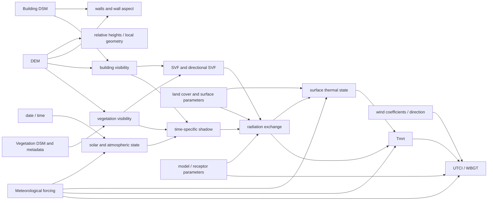

# Dependency graph and invalidation

## Why a graph is required

A component-specific implementation tends to encode rules such as “a tree changed, so update vegetation shadow.” That approach does not scale to building geometry, land cover, meteorology, or model parameters. The correct abstraction is a directed acyclic graph of source and derived scientific nodes.

Each edit adapter emits changed source nodes. The invalidation engine walks downstream edges and produces an exact execution plan.

## Canonical graph



The exact graph must be derived from the current code and versioned. This diagram is the architecture contract, not a claim that every node is already independently callable.

## Invalidation dimensions

Every invalidated node carries four dimensions:

1. **Stage**: which computation or cache becomes stale.
2. **Spatial scope**: none, one or more windows, or full tile.
3. **Temporal scope**: one timestep, a range, replay-from-start/checkpoint, or all supported time.
4. **Version scope**: site cache version, scenario revision, forcing revision, and model parameter revision.

A stage may be globally invalid but computationally cheap because expensive upstream caches remain valid.

## Scope combination

For a batch of heterogeneous edits:

```text
invalidated_nodes = union(adapter_i.invalidated_nodes)
spatial_scope(node) = safe_union_or_full(adapter_i.scope_for(node))
temporal_scope(node) = earliest_required_start_to_latest_required_end
```

Do not merge two distant local windows into one large rectangle when processing them separately is cheaper and scientifically equivalent. Do merge nearby windows when setup and cache overhead dominate.

## Example plans

### Add one tree

```text
changed source: vegetation_dsm
local: vegetation visibility, SVF, shadow, radiation, surface state, Tmrt, UTCI
replay: required day state in local read window
reuse: DEM, building DSM, walls, building visibility, forcing
fallback: full tile if influence/halo threshold is exceeded
```

### Change building height

```text
changed source: building_dsm
local or full: walls/aspect, building visibility, SVF, shadow, radiation, surface state, Tmrt, UTCI
reuse: forcing, untouched source windows
risk: longer and more complex visibility influence than surface paint
```

### Paint asphalt as grass

```text
changed source: landcover
local: surface parameters and downstream temporal/radiation outputs
reuse: walls, visibility, SVF, static geometry
replay: local surface state from safe predecessor time
```

### Change air temperature or humidity

```text
changed source: meteorology
full tile downstream: Tmrt inputs and/or UTCI, depending on equation path
reuse: geometry, walls, visibility, SVF, static shadow geometry
```

### Change selected hour

```text
changed source: selected_time
full spatial output for selected time, but geometry caches stay valid
invalidates: solar state, time-specific shadow/radiation, Tmrt, comfort
```

## Safety rule

The invalidation engine is conservative. If an adapter cannot prove that a downstream stage outside the proposed window is unchanged within validated semantics, that stage receives full-tile scope. Locality is an optimization policy, not an assumption.
